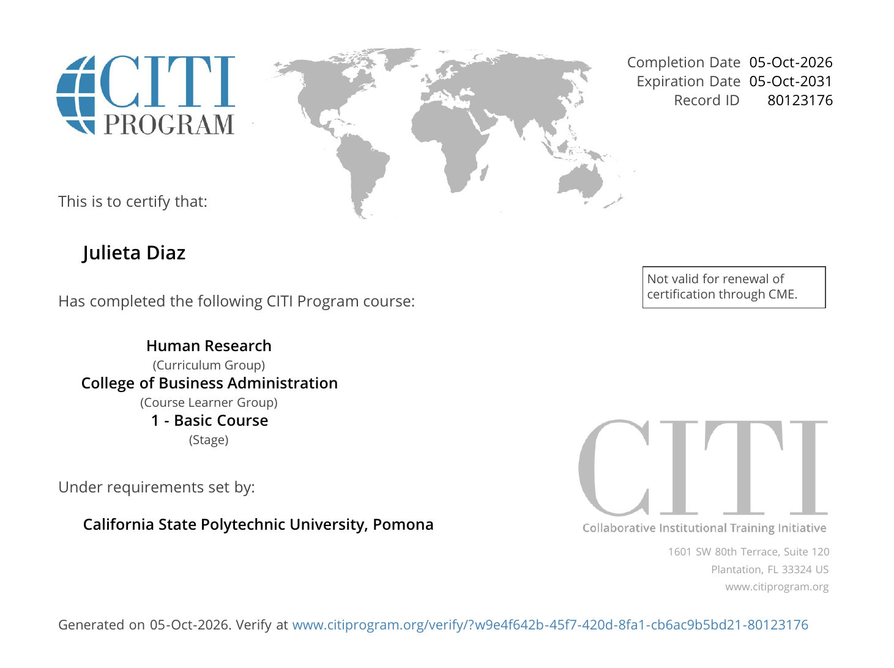

# Overview {.unnumbered}

For **IC8-2**, I completed the Collaborative Institutional Training Initiative (**CITI Program**) course in human subjects research required by Cal Poly Pomona's Institutional Review Board (IRB). The course is the College of Business Administration track, which combines the *CPP Introduction to Human Subjects* content with modules on research conducted online and in other countries.

::: {.callout-tip appearance="simple"}
## Why this matters for my work

Our team's CEP project for the CPP Farm Store includes a customer survey, and my other courses use Qualtrics surveys and consumer panels. This certification is the first step toward IRB approval for any study that collects data from people.
:::

# At a Glance

::: stat-grid
::: stat-card
[96%]{.stat-value}

[Final score]{.stat-label}
:::

::: stat-card
[14]{.stat-value}

[Modules completed]{.stat-label}
:::

::: stat-card
[80%]{.stat-value}

[Minimum to pass]{.stat-label}
:::

::: stat-card
[2031]{.stat-value}

[Valid through Oct 5]{.stat-label}
:::
:::

| Detail | Information |
|----------------------|--------------------------------------------------|
| Learner | Julieta Diaz |
| Curriculum group | Human Research |
| Course learner group | College of Business Administration |
| Stage | Stage 1, Basic Course |
| Institution | California State Polytechnic University, Pomona |
| Completion date | October 5, 2026 |
| Expiration date | October 5, 2031 |
| Record ID | 80123176 |

: Course and certificate details {#tbl-details}

# My Certificate

@fig-certificate shows my completion certificate, issued under the requirements set by Cal Poly Pomona.

::: cert-frame
{#fig-certificate fig-alt="CITI Program completion certificate issued to Julieta Diaz on October 5, 2026"}
:::

::: {style="text-align: center;"}
[Verify this certificate on CITI](https://www.citiprogram.org/verify/?w9e4f642b-45f7-420d-8fa1-cb6ac9b5bd21-80123176){.btn-gold}
[CPP IRB protocol page](https://www.cpp.edu/research/research-compliance/irb/protocol.shtml){.btn-outline}
:::

# Modules Completed

I completed all 14 required and elective modules on October 5, 2026, with a **reported score of 96%**, well above the 80% minimum (@tbl-modules).

| Module | Score | Result |
|----------------------------------------------|-----------|------------------------------------|
| Belmont Report and Its Principles | 3/3 | [[]{style="width:100%"}]{.bar} 100% |
| History and Ethical Principles (SBE) | 5/5 | [[]{style="width:100%"}]{.bar} 100% |
| Defining Research with Human Subjects (SBE) | 5/5 | [[]{style="width:100%"}]{.bar} 100% |
| The Federal Regulations (SBE) | 4/5 | [[]{style="width:80%"}]{.bar .partial} 80% |
| Assessing Risk (SBE) | 5/5 | [[]{style="width:100%"}]{.bar} 100% |
| Informed Consent (SBE) | 5/5 | [[]{style="width:100%"}]{.bar} 100% |
| Consent in the 21st Century | 4/5 | [[]{style="width:80%"}]{.bar .partial} 80% |
| Privacy and Confidentiality (SBE) | 5/5 | [[]{style="width:100%"}]{.bar} 100% |
| Cultural Competence in Research | 4/5 | [[]{style="width:80%"}]{.bar .partial} 80% |
| International Research (SBE) | 5/5 | [[]{style="width:100%"}]{.bar} 100% |
| Internet-Based Research (SBE) | 5/5 | [[]{style="width:100%"}]{.bar} 100% |
| Vulnerable Subjects: Workers/Employees | 4/4 | [[]{style="width:100%"}]{.bar} 100% |
| Conflicts of Interest in Human Subjects Research | 5/5 | [[]{style="width:100%"}]{.bar} 100% |
| California State Polytechnic University, Pomona Module | 11/11 | [[]{style="width:100%"}]{.bar} 100% |

: Module quiz scores from the CITI completion report (SBE = Social, Behavioral, and Educational research) {#tbl-modules}

# Key Takeaways

::: panel-tabset
## Ethical foundations

The **Belmont Report** grounds all human subjects research in three principles:

- **Respect for persons:** treat people as autonomous decision makers and protect those with reduced autonomy.
- **Beneficence:** maximize possible benefits and minimize possible harms.
- **Justice:** distribute the burdens and benefits of research fairly.

These principles explain *why* the federal rules and the IRB review process exist.

## Consent and privacy

- Informed consent is a **process**, not just a signature. Participants need to understand the purpose, risks, and their right to stop at any time.
- For online surveys, consent is usually shown on the first screen, and continuing counts as agreement.
- Collecting only the data I actually need, and separating identifiers from responses, is one of the simplest ways to protect **confidentiality**.

## Online and workplace research

- **Internet-based research** raises its own risks: IP addresses, third-party platforms, and data stored on outside servers all need to be considered.
- **International research** must respect local laws and cultural norms, not just U.S. rules.
- When participants are **workers or employees**, the researcher must avoid any pressure to participate and protect responses from supervisors.
:::

::: {.callout-note}
## Applying it to my projects

Before our team launches the Farm Store customer survey, we will need IRB review, a clear consent statement on the first Qualtrics screen, and a plan for keeping any loyalty-program purchase data separate from survey responses.
:::

# Appendix {.unnumbered}

::: link-list
**This report**

- [This report on GitHub Pages](https://jukedz.github.io/ibm6500-assignments/IC8-2-CITI-Certification/citi-certification.html)
- [Source folder on GitHub](https://github.com/jukedz/ibm6500-assignments/tree/main/IC8-2-CITI-Certification)
- [Quarto source file (.qmd)](https://github.com/jukedz/ibm6500-assignments/blob/main/IC8-2-CITI-Certification/citi-certification.qmd)

**Certification**

- [Verify my CITI certificate](https://www.citiprogram.org/verify/?w9e4f642b-45f7-420d-8fa1-cb6ac9b5bd21-80123176)
- [CITI Program](https://about.citiprogram.org/)

**Cal Poly Pomona IRB**

- [CPP IRB protocol and training requirements](https://www.cpp.edu/research/research-compliance/irb/protocol.shtml)
:::
