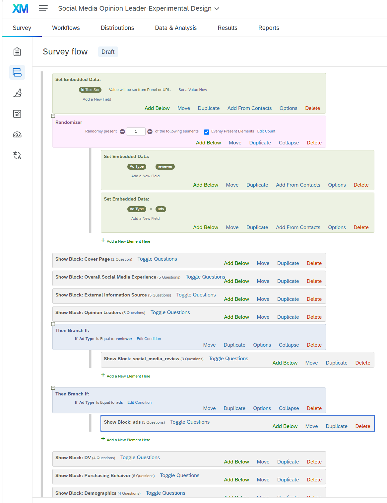
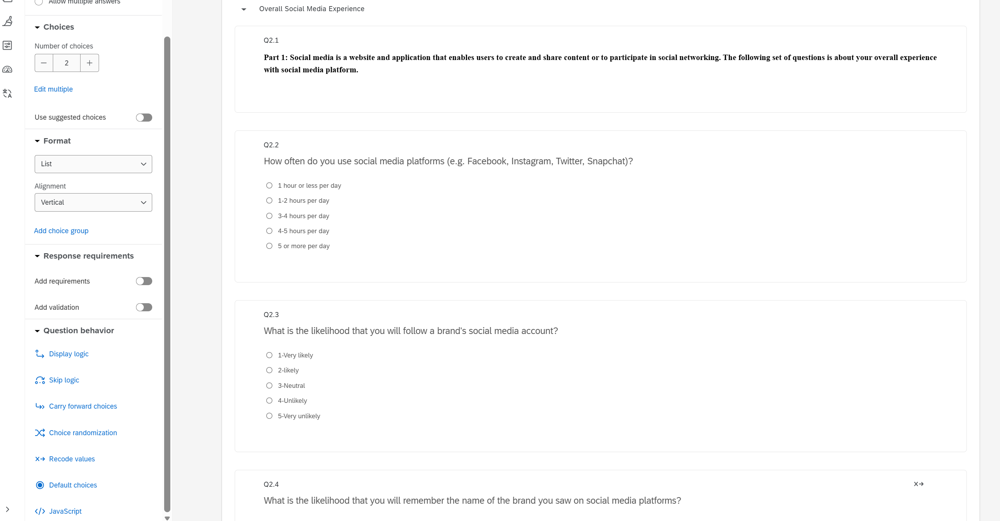
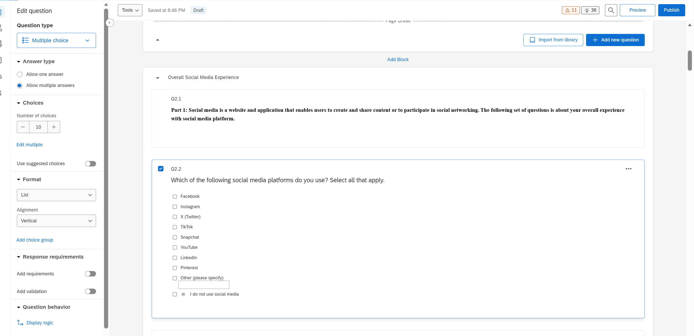
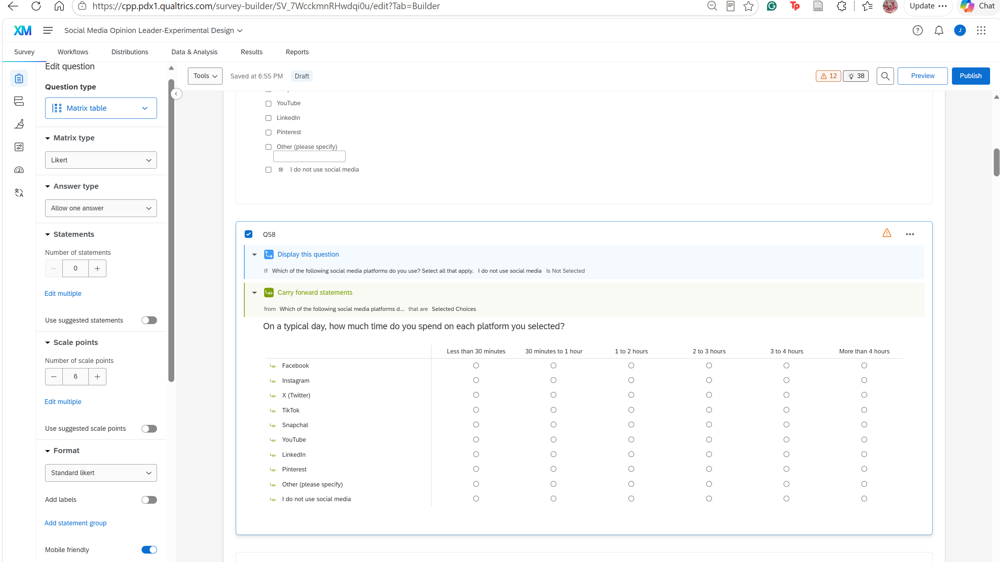
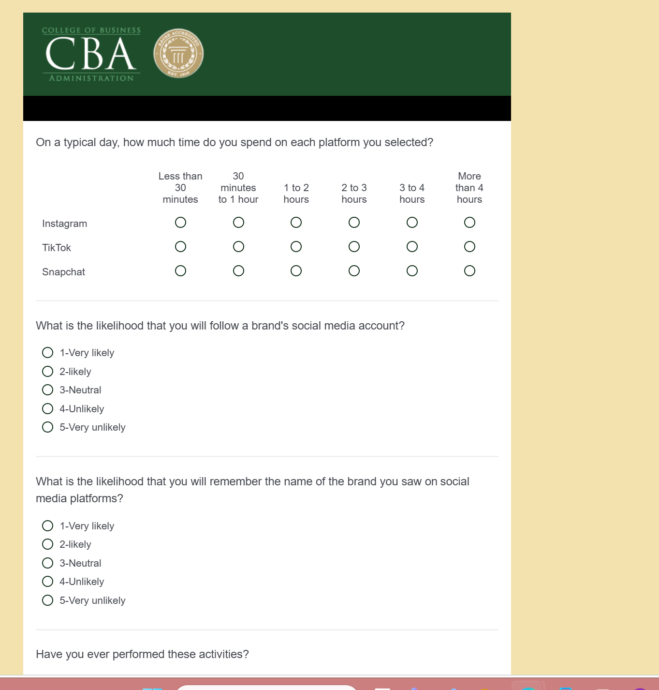
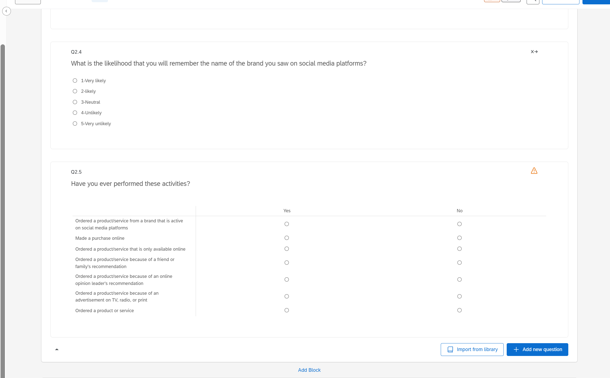
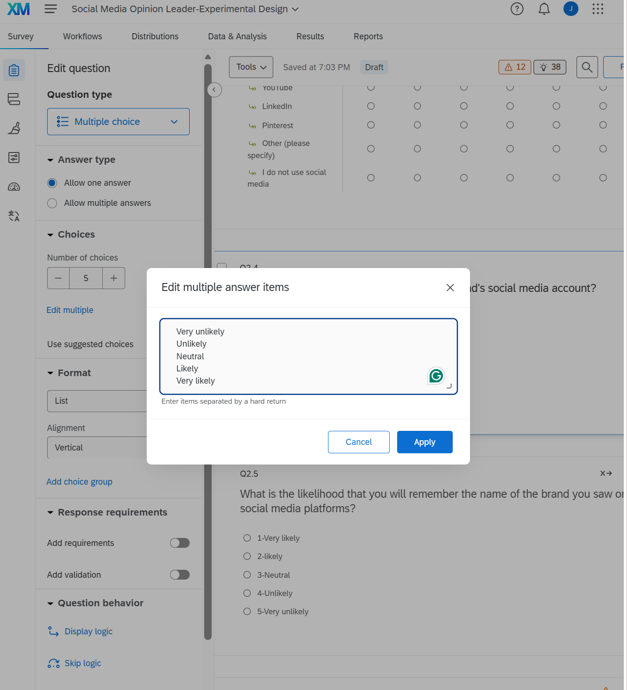
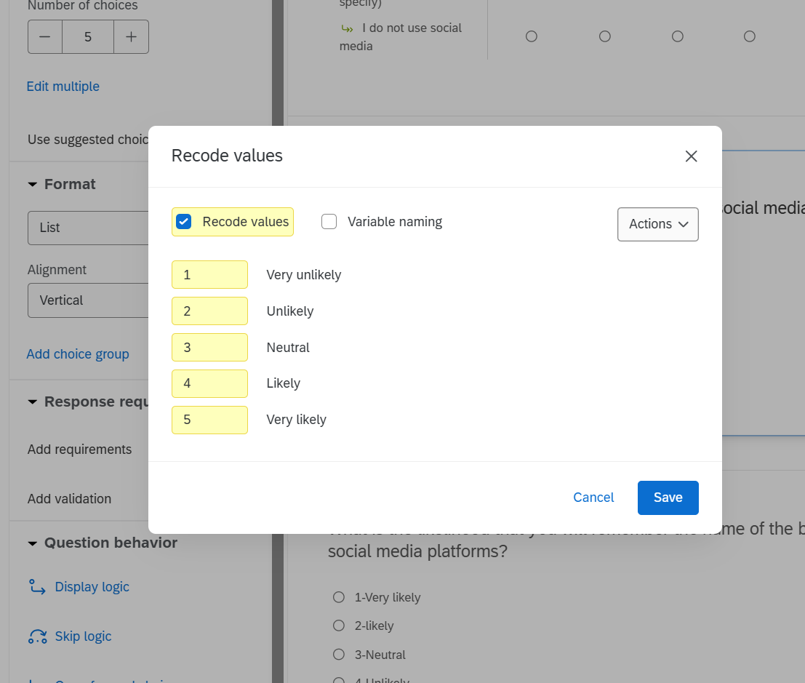
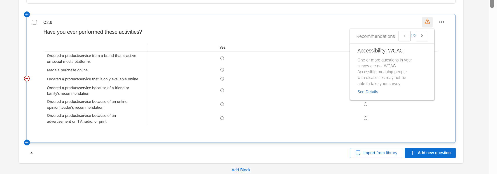

```{=html}
<style>
:root {
  --cpp-green: #1e4d2b;
  --cpp-gold: #c4a24c;
  --cpp-cream: #f6eed8;
}
body { background: #fbf8f0; font-family: "Segoe UI", "Helvetica Neue", Arial, sans-serif; }
h1.title {
  background: var(--cpp-green);
  color: #fff;
  padding: 22px 26px 14px 26px;
  border-radius: 8px 8px 0 0;
  margin-bottom: 0;
  border-bottom: 5px solid var(--cpp-gold);
}
p.subtitle {
  background: var(--cpp-green);
  color: var(--cpp-gold);
  padding: 0 26px 18px 26px;
  margin-top: 0;
  border-radius: 0 0 8px 8px;
  font-weight: 600;
}
h2 {
  color: var(--cpp-green);
  border-bottom: 3px solid var(--cpp-gold);
  padding-bottom: 6px;
  margin-top: 2.2rem;
}
h3 { color: var(--cpp-green); }
.figure img, figure img {
  border: 1px solid #d8d2bf;
  border-radius: 6px;
  box-shadow: 0 2px 8px rgba(0,0,0,0.08);
}
figcaption { color: #5a5a5a; font-style: italic; }
table { background: #fff; }
thead tr { background: var(--cpp-green); color: #fff; }
.why {
  background: var(--cpp-cream);
  border-left: 5px solid var(--cpp-gold);
  padding: 12px 16px;
  border-radius: 4px;
  margin: 1rem 0;
}
#TOC a.active { color: var(--cpp-green); font-weight: 600; }
</style>
```

# Overview

For this assignment I imported the *Social Media Opinion Leader-Experimental Design* survey (.qsf) into my Qualtrics account and completed the three tasks from the Step 5 instructions:

| Task | What I did | Qualtrics functions used |
|------|------------|--------------------------|
| 1. Random assignment | Randomly assigned each participant to see **only one** of the two ad treatments (social media review or ad), then routed everyone to the same DV questions | Embedded Data, Randomizer (Evenly Present), Branch |
| 2. Fix Q2.2 | Replaced the "overall time on social media" question with a select-all platform question plus a follow-up that asks usage time **for each platform separately** | Multiple answers, Carry Forward, Display Logic, Page Break |
| 3. Improve the questionnaire | Made four additional improvements to the quality of the questionnaire | Edit Multiple, Recode Values, Auto-number |

: Summary of tasks completed {.striped}

::: {.callout-note}
## Question numbering
After adding the new usage question, I used **Tools > Auto-number questions > Block (Q1.1)** to renumber the survey. The original Q2.3, Q2.4 and Q2.5 are now **Q2.4, Q2.5 and Q2.6**. The "before" screenshots below show the original numbers.
:::

# Task 1: Random Assignment with Randomizer and Branch

## Goal

The study compares two types of advertising for Nike: a **social media review** (block `social_media_review`) and a **traditional ad** (block `ads`). To compare them scientifically, each participant should see **only one** of the two, with about half of the sample in each condition. This is a **between-subjects design**. Because the assignment is random, the two groups should be equivalent on average (age, gender, attitude toward Nike, and so on), so any difference in the DV block can be attributed to the type of ad.

## Survey flow

{#fig-flow width="85%"}

## How the flow works

| Order | Flow element | Purpose |
|:-----:|--------------|---------|
| 1 | Set Embedded Data: `id` | Captures the participant ID from the panel or URL as soon as they land on the survey |
| 2 | **Randomizer**: randomly present **1** of the following elements, **Evenly Present Elements** checked | Assigns each participant to exactly one condition and keeps the two groups about equal in size |
| 2a | Set Embedded Data: `Ad Type = reviewer` | Condition 1 |
| 2b | Set Embedded Data: `Ad Type = ads` | Condition 2 |
| 3 to 6 | Cover Page, Overall Social Media Experience, External Information Source, Opinion Leaders | Shown to **everyone** |
| 7 | **Branch**: If `Ad Type` Is Equal to `reviewer` > Show Block `social_media_review` | Only condition 1 sees the review |
| 8 | **Branch**: If `Ad Type` Is Equal to `ads` > Show Block `ads` | Only condition 2 sees the ad |
| 9 to 11 | DV, Purchasing Behavior, Demographics | Shown to **everyone**, regardless of condition |

: Survey flow logic {.striped}

::: {.why}
**Why this design works**

- **The randomizer is placed right after the `id` is assigned**, the earliest point in the flow, so the condition is set before the participant sees any content.
- **Evenly Present Elements** makes Qualtrics balance the two conditions instead of relying on pure chance, which could leave the groups uneven in a small sample.
- **The condition is stored as Embedded Data (`Ad Type`)**, so it is saved in the dataset for every respondent. This lets me compare the DV responses by condition during analysis.
- **The randomizer only sets a value; the branches show the blocks.** This keeps the ad exposure in its logical place, after the Opinion Leaders block and right before the DV block, instead of at the start of the survey.
- I removed the original `social_media_review` and `ads` blocks from the main flow, so no participant sees both treatments.
- **DV, Purchasing Behavior, and Demographics stay at the main level** (not inside a branch), so every participant answers the same dependent variable questions.
:::

I tested the flow in **Preview** several times and confirmed that each run showed either the social media review or the ad, never both.

# Task 2: Measuring Usage for Each Social Media Platform

## The problem with the original Q2.2

{#fig-q22-before width="90%"}

The original Q2.2 asked, *"How often do you use social media platforms (e.g. Facebook, Instagram, Twitter, Snapchat)?"* It only measures the **total** time across all platforms, so there is no way to tell how much time a respondent spends on each one. Using piped text with a single-answer "most often" question (like the Q58/Q59 example in the instructions) is not enough either, because most people use several platforms and that approach only captures one.

## My solution: Multiple answers + Carry Forward

I used the **Carry Forward** method in two steps.

### Step 1: Ask which platforms they use (Q2.2)

{#fig-q22-after width="95%"}

- Reworded to: *"Which of the following social media platforms do you use? Select all that apply."*
- Changed the answer type to **Allow multiple answers** (left panel), so respondents can check every platform they use, not only the one they use most.
- Updated the list to current platforms: Facebook, Instagram, X (Twitter), TikTok, Snapchat, YouTube, LinkedIn, Pinterest.
- **Other (please specify)** has **text entry**, so platforms not on the list are still captured.
- **I do not use social media** is set as **mutually exclusive** (the ✲ icon), so it cannot be checked along with a platform.

### Step 2: Ask usage time for each selected platform (Q2.3)

{#fig-q23 width="95%"}

- **Question type:** Matrix table (Likert, one answer per row).
- **Question text:** *"On a typical day, how much time do you spend on each platform you selected?"*
- **Carry forward statements:** from Q2.2, **Selected Choices**. Each platform the respondent checked becomes a row, and only those rows are shown.
- **Display logic:** show this question only if *"I do not use social media"* **Is Not Selected** in Q2.2, so non-users are not asked about usage time.
- **Page break** between Q2.2 and Q2.3, since carry forward can only use answers that were submitted on an earlier page.
- **Mobile friendly** is turned on so the matrix displays well on phones.

## Testing in Preview

{#fig-preview width="70%"}

::: {.why}
**Why carry forward is the better approach**

The alternative method would need a separate question for every platform, each with its own piped text and display logic (8 or more questions to build and maintain). Carry forward does the same job with **one** question: the rows update automatically from Q2.2, so adding a new platform to Q2.2 updates Q2.3 with no extra setup. Respondents only see the platforms they actually use, and the data gives a separate usage rate for each platform instead of one combined number.
:::

# Task 3: Additional Improvements to the Questionnaire

## Improvement 1: Fixed the gaps and overlaps in the time scale

The original Q2.2 answer choices were: *1 hour or less, 1-2 hours, 3-4 hours, 4-5 hours, 5 or more*.

| Problem | Example |
|---------|---------|
| **Gap** | Someone who uses social media for 2.5 hours has no correct answer (nothing between 2 and 3 hours) |
| **Overlap** | Exactly 1 hour fits "1 hour or less" **and** "1-2 hours"; 4 hours fits "3-4" **and** "4-5"; 5 hours fits "4-5" **and** "5 or more" |
| **Missing unit** | "5 or more per day" does not say hours |

: Problems with the original scale {.striped}

The new Q2.3 scale (@fig-q23) uses **mutually exclusive and exhaustive** categories: *Less than 30 minutes, 30 minutes to 1 hour, 1 to 2 hours, 2 to 3 hours, 3 to 4 hours, More than 4 hours*.

::: {.why}
**Why it's better:** Every respondent has exactly one correct answer, so the data is not distorted by people guessing between two categories or skipping the question. The lower end is also split into smaller ranges (under 30 minutes, 30 minutes to 1 hour), which captures light users per platform more precisely.
:::

## Improvement 2: Reordered the likelihood scales and set consistent recode values (Q2.4 and Q2.5)

{#fig-likert-before width="80%"}

The original scales ran from *1-Very likely* to *5-Very unlikely*, with labels like "2-likely" that mixed numbers into the text and used inconsistent capitalization. Also, only one of the two questions had recode values set (the x→ icon in @fig-likert-before), so the two questions were not coded the same way.

::: {layout-ncol=2}
{#fig-likert-new}

{#fig-recode}
:::

I applied the same answer choices and the same recode values (1 = Very unlikely, 5 = Very likely) to both Q2.4 and Q2.5.

::: {.why}
**Why it's better:** With the original coding, a **higher** number meant **less** likely, which is counterintuitive and easy to misread during analysis (for example, a higher mean would look like a better result when it is actually worse). Now a higher score means a higher likelihood, both questions use identical coding so they can be compared or combined, and the labels are clean and consistent.
:::

## Improvement 3: Removed a redundant row from the activities matrix (Q2.6)

The original Q2.6 matrix (*"Have you ever performed these activities?"*) ended with the row **"Ordered a product or service."** Anyone who answered "Yes" to any other row has, by definition, ordered a product or service, so this row adds no new information.

{#fig-q26 width="90%"}

::: {.why}
**Why it's better:** A shorter matrix reduces survey fatigue, and removing an item that overlaps every other item avoids redundant data. Matrix tables are also flagged by Qualtrics' own recommendations (accessibility and completion rate), so keeping them as short as possible matters. **Mobile friendly** is turned on for this matrix as well.
:::

## Improvement 4: Added a page break and renumbered the questions

- **Page break after Q2.2:** Without it, Q2.2 and the carry forward matrix were on the same page, and the matrix showed **no rows** because the selections had not been submitted yet. With the page break, the matrix shows the selected platforms (@fig-preview).
- **Auto-numbering (Block, Q1.1):** Adding a new question created an out-of-order label (Q58). Renumbering by block gives clean, sequential labels (Q2.1 to Q2.6), which makes the exported dataset and the codebook easier to follow.

::: {.why}
**Why it's better:** The page break makes the carry forward function actually work for respondents, and consistent question numbers prevent confusion when matching data columns to questions during analysis.
:::

# Summary

| Item | Before | After |
|------|--------|-------|
| Ad exposure | Every participant saw **both** ads | Each participant randomly sees **one** ad (balanced), stored as `Ad Type` |
| Social media usage | One question on total time across all platforms | Select-all platform question + carry forward matrix with usage **per platform** |
| Time scale | Gaps and overlapping categories | Mutually exclusive, exhaustive ranges |
| Likelihood scales | 1 = Very likely, inconsistent coding | 1 = Very unlikely to 5 = Very likely, same recode on both |
| Activities matrix | 7 rows, one redundant | 6 rows |
| Survey structure | Carry forward on same page, Q58 label | Page break added, questions renumbered by block |

: Before and after {.striped}

# Appendix

- **GitHub repository:** [https://github.com/jukedz/ibm6500-assignments/tree/main/Qualtrics-M02-Experimental-Design](https://github.com/jukedz/ibm6500-assignments/tree/main/Qualtrics-M02-Experimental-Design)
- **GitHub Pages (published report):** [https://jukedz.github.io/ibm6500-assignments/Qualtrics-M02-Experimental-Design/Qualtrics_Assignment_2-Diaz_Julie.html](https://jukedz.github.io/ibm6500-assignments/Qualtrics-M02-Experimental-Design/Qualtrics_Assignment_2-Diaz_Julie.html)
